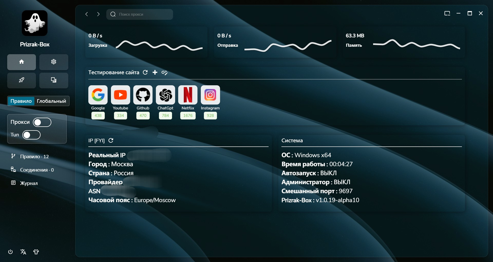
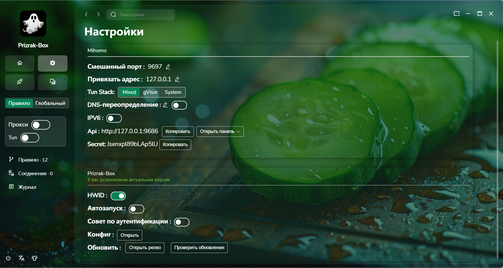
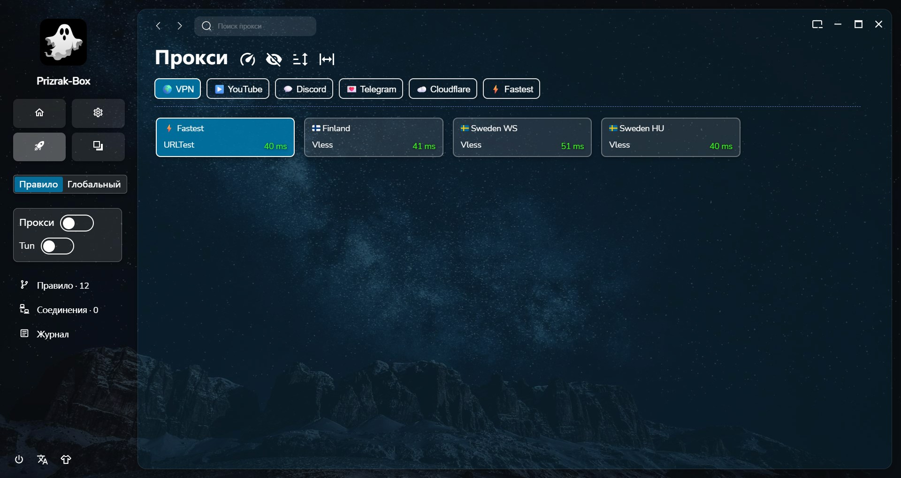
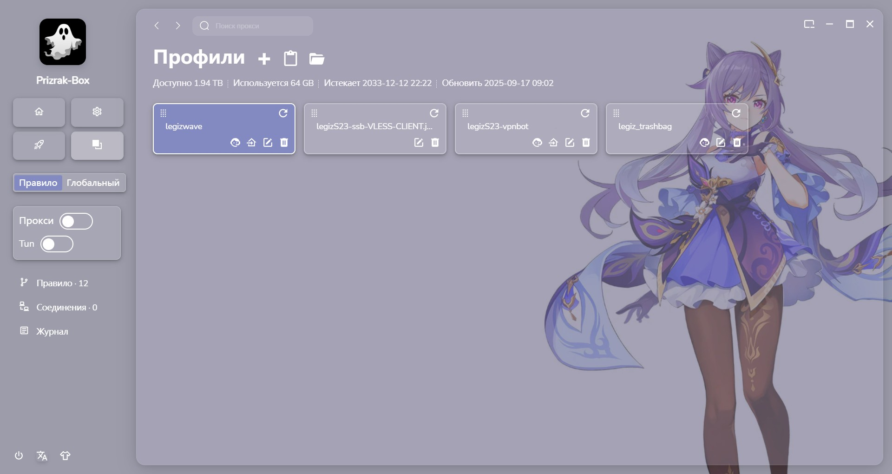

  
  <h1>Prizrak-Box</h1>
  
A simple desktop client for Mihomo

## Download

[Download the App](https://github.com/legiz-ru/Prizrak-Box/releases)

## Features

- Supports local HTTP/HTTPS/SOCKS proxies
- Supports Vmess, Vless, Shadowsocks, Trojan, Tuic, Hysteria, Hysteria2, Wireguard, and Mieru protocols
- Supports parsing of share links, subscription links, Base64 format, and YAML format
- Built-in subscription converter to convert various subscription types into Mihomo-compatible configurations
- Automatically adds minimal rule groups to unruly subscriptions
- DNS overwrite option to prevent DNS leaks
- Unified rules and group settings for all subscriptions
- Supports TUN mode

## Deeplink Import

- Profiles can be imported directly by opening a link in the form `prizrak-box://install-config?url=https://sub.example.com/username`
- Extra parameters in the deeplink are ignored, while query parameters inside the subscription URL are preserved

## Supported Platforms

- Windows 10/11 (AMD64 / ARM64)
- macOS 11.0+ (AMD64 / ARM64)
- Linux (AMD64 / ARM64)

## How to Enable TUN Mode

- Go to `Settings` → `Enable Authorization` → Restart the app → When the authorization prompt appears, grant
  permission → TUN mode can then be enabled in the app

## Note: Px Requires Network Access

- When prompted, click "Allow" to grant network access

## Common macOS Issues

- See [mac.md](mac/mac.md)

## Major Improvements in the Latest Version

1. Redesigned interface with support for theme switching, language switching, and drag-and-drop import
2. Search bar at the top to quickly switch between nodes in the current configuration
3. Added support for minimizing to system tray
4. Unified rule templates:
    - Simple groups for lightweight users
    - Multi-region groups
    - Full rule groups for advanced users
5. Web scraping and import/export modules from version 0.2 are not yet included

## Todo / Future Plans

- Web scraping module
- Import/export module
- Bug fixes

## Preview

| Tab      | New Interface with Different Themes |
|----------|-------------------------------------|
| Home     |             |
| Settings |          |
| Proxies  |          |
| Profiles |        |
