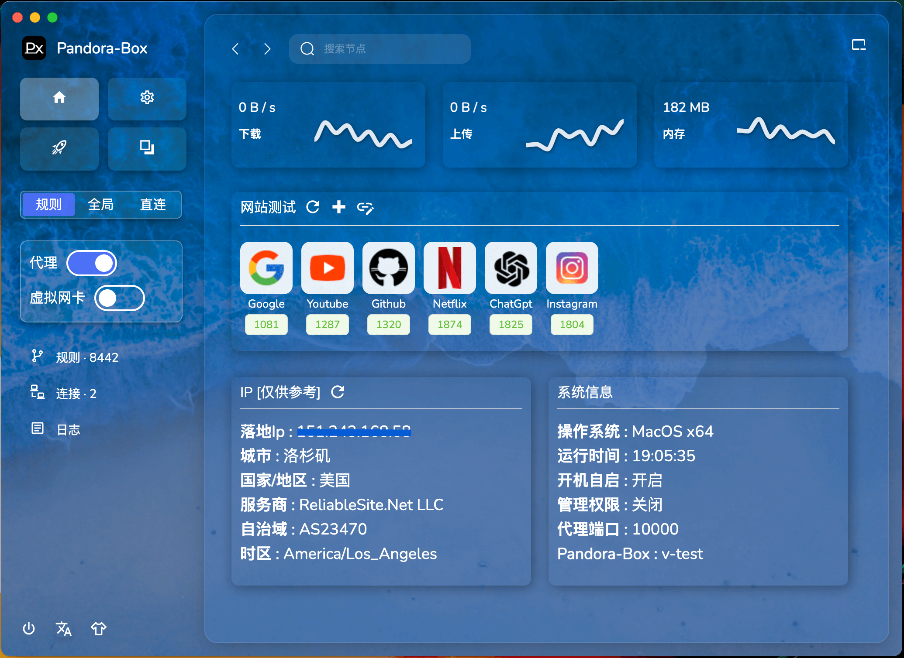
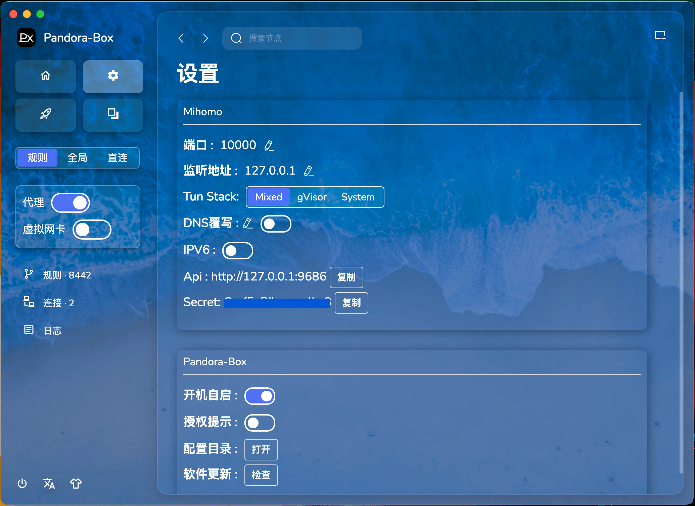
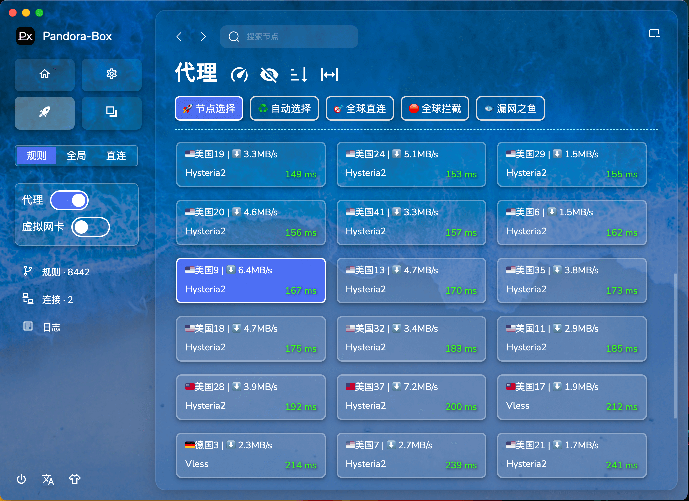

<div align="center">
  
  <h1>Prizrak-Box</h1>
  <p>Простой настольный клиент Mihomo</p>
</div>

## Ссылка на скачивание

[Скачать приложение](https://github.com/legiz-ru/Prizrak-Box/releases)

## Основные функции

- Поддержка локального HTTP/HTTPS/SOCKS прокси
- Поддержка протоколов: Vmess, Vless, Shadowsocks, Trojan, Tuic, Hysteria, Hysteria2, Wireguard, Mieru
- Поддержка обмена ссылками, подписками, форматов Base64 и Yaml
- Встроенная конвертация подписок для создания конфигурации Mihomo
- Автоматическое добавление минимальных групп правил для неподготовленных подписок
- Включение перезаписи DNS для предотвращения утечки DNS
- Поддержка унификации правил и групп для всех подписок
- Поддержка режима TUN

## Поддерживаемые платформы

- Windows 10/11 AMD64/ARM64
- macOS 11.0+ AMD64/ARM64
- Linux AMD64/ARM64

## Как включить TUN

- Настройки → Включить авторизацию → Перезапустить приложение → Подтвердить авторизацию в всплывающем окне → Готово
- После входа в приложение можно активировать режим TUN

## Импорт профилей через Deeplink

Prizrak-Box поддерживает импорт профилей через deeplink URL, что позволяет пользователям легко добавлять подписки из внешних источников.

### Схема URL

Deeplink использует пользовательский протокол `prizrak-box://` в следующем формате:

```
prizrak-box://install-config?url=SUBSCRIPTION_URL
```

### Примеры использования

```bash
# Простая подписка
prizrak-box://install-config?url=https://sub.example.com/username

# URL с параметрами (все параметры сохраняются)
prizrak-box://install-config?url=https://example.com/sub?token=abc123&format=json

# Сложные URL с множественными параметрами
prizrak-box://install-config?url=https://service.com/api?user=test&token=xyz&region=us
```

### Особенности

- ✅ Работает из любой вкладки приложения
- ✅ Работает при запуске приложения из закрытого состояния
- ✅ Корректно обрабатывает URL с множественными параметрами
- ✅ Автоматически переходит на страницу профилей после импорта
- ✅ Показывает уведомления об успехе или ошибке

## Запрос Px на сетевой доступ

- Просто нажмите "Разрешить"

## Часто задаваемые вопросы для macOS

- [mac.md](mac/mac.md)

## Основные изменения в новой версии

1. Обновленный интерфейс: поддержка смены фона, языка и перетаскивания файлов
2. Поиск по текущим узлам конфигурации для быстрого переключения
3. Добавлена возможность минимизации в трей
4. Унифицированные шаблоны правил: минималистичные группы, национальные группы, полные группы
5. Модуль парсинга и импорта/экспорта данных из версии v0.2 пока не перенесены

## Планируемые задачи

- Модуль парсинга
- Модуль импорта/экспорта
- Исправление ошибок

## Превью

| Страница  | Пример интерфейса             |
|-----------|-------------------------------|
| Главная   |       |
| Настройки |    |
| Прокси    |    |
| Подписки  |  |
