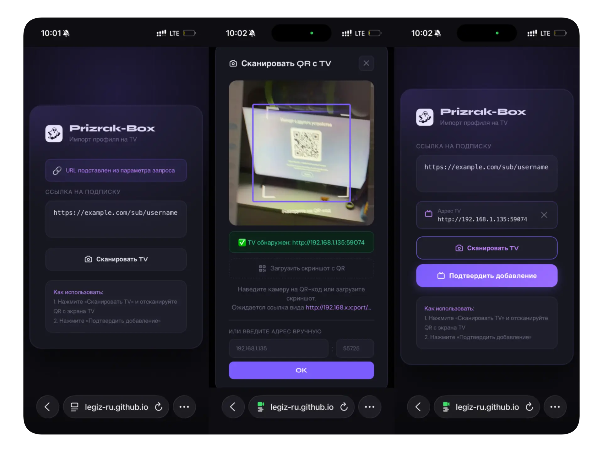

import { Steps, Aside, LinkCard } from '@astrojs/starlight/components';

Prizrak-Box runs on Android TV with the same functionality as the Android phone version.
Because Android TV has no browser or camera for QR scanning, profile import works differently.

## Importing a Subscription

The easiest way to import a subscription to an Android TV device is via **[pxtv](https://github.com/legiz-ru/pxtv)** —
a lightweight web page that transfers a subscription link or YAML configuration from your phone to the TV over your local Wi-Fi network.

<Steps>
1. Make sure your phone and Android TV are connected to the **same Wi-Fi network**.
2. On the TV, open Prizrak-Box and navigate to the **Import** screen. The TV will display a local IP address and a QR code.
3. On your phone, open **[pxtv](https://github.com/legiz-ru/pxtv)** or scan the QR code directly.
4. Enter or paste your subscription URL into pxtv and confirm.
5. The subscription is sent to Prizrak-Box on the TV instantly — no manual typing required.
</Steps>

<Aside type="tip">
If your phone and TV are on different networks, you can also paste the TV's local IP address manually into the pxtv page on your phone.
</Aside>

## pxtv — Import from a Subscription Page

**[pxtv](https://github.com/legiz-ru/pxtv)** is a companion web app built specifically for Prizrak-Box on Android TV.

Its main purpose: **let users import a subscription directly from their provider's web page** — without copy-pasting long URLs on a TV keyboard.

The workflow:
1. Open pxtv on your phone (it works as a web page — no installation needed).
2. Enter or tap your subscription link on the phone.
3. pxtv sends the link to the TV over local Wi-Fi.
4. Prizrak-Box on the TV receives and adds the subscription automatically.

<LinkCard
  title="pxtv on GitHub"
  description="Web page for transmitting a subscription link or YAML configuration to Prizrak-Box on Android TV."
  href="https://github.com/legiz-ru/pxtv"
/>

## Manual Import

If you prefer not to use pxtv, you can also type the subscription URL directly on the TV using the on-screen keyboard, or use Android TV's built-in text sharing if your launcher supports it.
