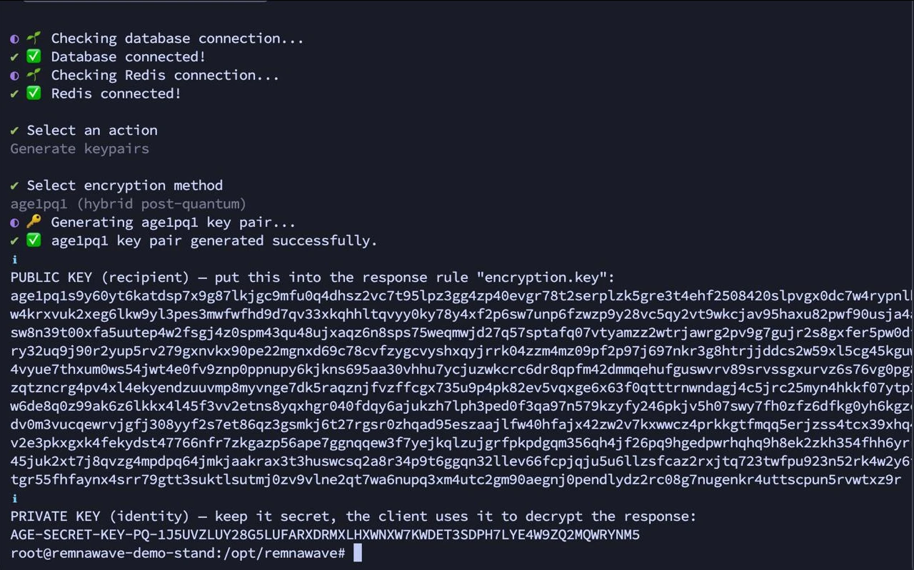

import { Aside, Steps, Tabs, TabItem } from '@astrojs/starlight/components';

AGE encryption protects your proxy subscription config so that only the client with the matching secret key can read it.
Even if someone intercepts the HTTPS traffic or obtains the subscription URL, they receive only encrypted data.

## How it works

```
┌─────────────────────────────────────────────────────────────────┐
│  1 · Key generation  (run once on the admin side)               │
│                                                                  │
│  Key generation methods are listed below                        │
│                                                                  │
│  AGE-SECRET-KEY-…  (secret)  →  client (Prizrak-Box)            │
│  age1…             (public)  →  server (Remnawave)              │
└───────────────────────┬─────────────────────────────────────────┘
                        │
          Public key  ──────────────────────►  Remnawave (server)
          Secret key  ──────────────────────►  Prizrak-Box (client)

┌─────────────────────────────────────────────────────────────────┐
│  2 · Remnawave  (subscription server)                           │
│                                                                  │
│  Detects request from Prizrak-Box via User-Agent header         │
│  Fetches YAML config  →  encrypts with age1pq1…                 │
│  Returns ASCII-armored .age file                                │
└───────────────────────┬─────────────────────────────────────────┘
                        │ HTTPS  (encrypted data)
┌───────────────────────▼─────────────────────────────────────────┐
│  3 · Prizrak-Box  (client)                                      │
│                                                                  │
│  Stores AGE-SECRET-KEY-PQ-1… in profile settings               │
│  age.SetGlobalSecretKeys(key)                                    │
│  Decrypts armor  →  parses YAML  →  applies profile            │
└─────────────────────────────────────────────────────────────────┘
```

The hybrid **ML-KEM-768 + X25519** scheme is used (`age1pq1…` / `AGE-SECRET-KEY-PQ-1…`).
Classic X25519 keys (`age1…` / `AGE-SECRET-KEY-1…`) are also supported.

<Aside type="note">
Mihomo core documentation on `age-secret-key`:
[wiki.metacubex.one/en/config/proxy-providers/#age-secret-key](https://wiki.metacubex.one/en/config/proxy-providers/#age-secret-key)
</Aside>

---

## Generating a key pair

<Tabs>
  <TabItem label="Prizrak-Box Desktop">
    **Key generation via Prizrak-Box Desktop**

    **Settings → Core Settings**

    Find the **AGE Key Generation** section and click **Generate**.
    The app displays both the public key and the secret key.
    Copy the secret key — you will need to enter it into Remnawave.
  </TabItem>

  <TabItem label="Prizrak-Box Android">
    **Key generation via Prizrak-Box Android**

    **Settings → Meta Features → AGE Key Generation** (bottom of the list)

    Tap **Generate key pair**.
    Copy the **secret key** (`AGE-SECRET-KEY-PQ-1…`) — paste it into Remnawave.
    The public key (`age1pq1…`) is shown separately and is needed on the server side.
  </TabItem>

  <TabItem label="Remnawave CLI">
    **Key generation via Remnawave CLI**

    <Steps>
      1. Run the CLI:
         ```bash
         docker exec -it remnawave remnawave
         ```

      2. Select **Generate keypairs** → **age1pq1 (hybrid post-quantum)**.

      3. The CLI outputs:
         - **PUBLIC KEY** (`age1pq1…`) — paste into the `encryption.key` field of the response rule.
         - **PRIVATE KEY** (`AGE-SECRET-KEY-PQ-1…`) — give to the client to enter in Prizrak-Box settings.
    </Steps>

    
  </TabItem>
</Tabs>

---

## Setting up Remnawave

<Aside type="caution">
Age encryption in Remnawave response rules requires **version 2.8 or later**.
</Aside>

### Step 1 — Create a response rule

In the Remnawave admin panel go to **Response Rules** and create a new rule.
**Add it at the top of the list** so it takes priority over other rules.

Use the following JSON as a starting template and fill in your values:

```json
{
  "name": "Prizrak-Box",
  "description": "Prizrak-Box for Desktop & Android — age encrypted config",
  "enabled": true,
  "operator": "AND",
  "conditions": [
    {
      "headerName": "user-agent",
      "operator": "CONTAINS",
      "value": "Clash-Meta/Prizrak-Box (",
      "caseSensitive": false
    }
  ],
  "responseType": "MIHOMO",
  "responseModifications": {
    "encryption": {
      "method": "age1pq1",
      "key": "age1pq1…"
    }
  }
}
```

| Field | What to put there |
|---|---|
| `responseType` | `MIHOMO` — response type for mihomo config (encryption is set separately via `responseModifications`) |
| `responseModifications.encryption.method` | `age1pq1` for post-quantum key or `age1` for classic X25519 |
| `responseModifications.encryption.key` | The **public key** (`age1pq1…` or `age1…`) generated in the previous step |

### Step 2 — Disable the plain `/mihomo` endpoint

Once encryption is active, disable plain-text access to the mihomo config so clients cannot bypass encryption by hitting `/mihomo` directly.

In the same response rule, add the `settings` field before `rules`:

```json
{
  ...
  "settings": {
    "disableSubscriptionAccessByPath": true
  },
  "rules": [
    ...
  ]
}
```

This disables `/json`, `/stash`, `/mihomo`, and similar plain-text endpoints for all users in the panel.

<Aside type="tip">
When using age-encrypted configs, it is best practice to only distribute **encrypted** subscription formats to clients:
- mihomo age (this guide)
- happ / v2raytun cryptolink

Avoid sharing plain-text mihomo, Clash, or base64 links if the same users are already set up with encrypted configs.
</Aside>

---

## Configuring Prizrak-Box

After generating the key pair, enter the **secret key** in the client:

**Prizrak-Box Desktop** — click the key icon in the bottom-left corner to activate the secret key input field, paste `AGE-SECRET-KEY-PQ-1…`, and click **Confirm** to add the profile.

**Prizrak-Box Android** — tap the key icon in the top-right corner to activate the secret key input field, paste `AGE-SECRET-KEY-PQ-1…`, and tap the save profile icon.
